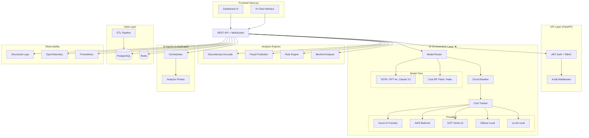

# Enterprise Multi-Cloud AI Orchestrator - 実装計画書

## 1. 全体ディレクトリ構造

```
cs-risk-agent/
├── .github/
│   └── workflows/
│       ├── ci.yml                    # Lint + Test + Coverage
│       ├── cd-staging.yml            # Staging デプロイ
│       └── cd-production.yml         # Production デプロイ
│
├── backend/                          # Python FastAPI Backend
│   ├── pyproject.toml                # プロジェクト定義 (PEP 621)
│   ├── alembic.ini                   # DB マイグレーション設定
│   ├── alembic/
│   │   └── versions/                 # マイグレーションファイル
│   │
│   ├── src/
│   │   └── cs_risk_agent/
│   │       ├── __init__.py
│   │       ├── main.py               # FastAPI エントリポイント
│   │       ├── config.py             # Pydantic Settings
│   │       │
│   │       ├── api/                  # API Layer
│   │       │   ├── __init__.py
│   │       │   ├── deps.py           # 依存性注入
│   │       │   ├── middleware.py     # CORS, Auth, Audit middleware
│   │       │   └── v1/
│   │       │       ├── __init__.py
│   │       │       ├── router.py
│   │       │       ├── health.py
│   │       │       ├── companies.py
│   │       │       ├── analysis.py
│   │       │       ├── risk_scores.py
│   │       │       ├── ai_insights.py
│   │       │       ├── reports.py
│   │       │       └── admin.py
│   │       │
│   │       ├── core/                 # Core Domain Logic
│   │       │   ├── __init__.py
│   │       │   ├── exceptions.py     # カスタム例外
│   │       │   ├── security.py       # 認証・認可
│   │       │   └── events.py         # ドメインイベント
│   │       │
│   │       ├── ai/                   # AI Orchestration Layer ★
│   │       │   ├── __init__.py
│   │       │   ├── provider.py       # Abstract Provider Interface
│   │       │   ├── registry.py       # Provider Registry & Factory
│   │       │   ├── router.py         # Intelligent Model Router
│   │       │   ├── circuit_breaker.py # FinOps サーキットブレーカー
│   │       │   ├── cost_tracker.py   # コスト追跡・予算管理
│   │       │   ├── model_tier.py     # Model Tiering (SOTA/CostEffective)
│   │       │   │
│   │       │   ├── providers/        # Provider Pattern 実装
│   │       │   │   ├── __init__.py
│   │       │   │   ├── azure_foundry.py   # Azure AI Foundry
│   │       │   │   ├── aws_bedrock.py     # AWS Bedrock
│   │       │   │   ├── gcp_vertex.py      # GCP Vertex AI
│   │       │   │   ├── ollama_local.py    # Ollama (Local LLM)
│   │       │   │   └── vllm_local.py      # vLLM (Local LLM)
│   │       │   │
│   │       │   └── agents/           # LangGraph AI Agents
│   │       │       ├── __init__.py
│   │       │       ├── orchestrator.py    # メインオーケストレーター
│   │       │       ├── anomaly_probe.py   # 異常検知プローブ
│   │       │       ├── ratio_probe.py     # 財務比率プローブ
│   │       │       ├── trend_probe.py     # トレンドプローブ
│   │       │       ├── relationship_probe.py
│   │       │       └── cross_ref_probe.py
│   │       │
│   │       ├── analysis/             # 分析エンジン
│   │       │   ├── __init__.py
│   │       │   ├── discretionary_accruals.py  # 裁量的発生高モデル
│   │       │   ├── fraud_prediction.py        # 不正予測モデル
│   │       │   ├── rule_engine.py             # ルールベーススコアリング
│   │       │   ├── benford.py                 # ベンフォード法則分析
│   │       │   └── risk_scorer.py             # 統合リスクスコアリング
│   │       │
│   │       ├── data/                 # データ層
│   │       │   ├── __init__.py
│   │       │   ├── models.py         # SQLAlchemy Models
│   │       │   ├── schemas.py        # Pydantic Schemas
│   │       │   ├── repository.py     # Repository Pattern
│   │       │   └── database.py       # DB接続管理
│   │       │
│   │       ├── etl/                  # ETL パイプライン
│   │       │   ├── __init__.py
│   │       │   ├── edinet_client.py  # EDINET API クライアント
│   │       │   ├── xbrl_parser.py    # XBRL パーサー
│   │       │   ├── excel_loader.py   # Excel データ取込
│   │       │   └── pipeline.py       # Celery タスク定義
│   │       │
│   │       ├── reports/              # レポート生成
│   │       │   ├── __init__.py
│   │       │   ├── pdf_generator.py  # PDF レポート
│   │       │   ├── pptx_generator.py # PPTX レポート
│   │       │   └── templates/        # レポートテンプレート
│   │       │
│   │       └── observability/        # 可観測性
│   │           ├── __init__.py
│   │           ├── logging.py        # 構造化ログ (JSON)
│   │           ├── tracing.py        # OpenTelemetry トレース
│   │           ├── metrics.py        # カスタムメトリクス
│   │           └── audit.py          # 監査ログ
│   │
│   └── tests/
│       ├── conftest.py
│       ├── unit/
│       │   ├── test_ai_provider.py
│       │   ├── test_circuit_breaker.py
│       │   ├── test_cost_tracker.py
│       │   ├── test_model_router.py
│       │   ├── test_discretionary_accruals.py
│       │   ├── test_fraud_prediction.py
│       │   ├── test_rule_engine.py
│       │   ├── test_benford.py
│       │   ├── test_risk_scorer.py
│       │   └── test_audit.py
│       ├── integration/
│       │   ├── test_api_endpoints.py
│       │   ├── test_provider_failover.py
│       │   └── test_etl_pipeline.py
│       └── e2e/
│           └── test_business_scenarios.py
│
├── frontend/                         # Next.js Dashboard
│   ├── package.json
│   ├── next.config.ts
│   ├── tailwind.config.ts
│   ├── tsconfig.json
│   ├── src/
│   │   ├── app/                      # App Router
│   │   │   ├── layout.tsx
│   │   │   ├── page.tsx              # S01: Risk Overview
│   │   │   ├── segments/
│   │   │   │   └── page.tsx          # S02: Segment Analysis
│   │   │   ├── subsidiaries/
│   │   │   │   └── [id]/page.tsx     # S03: Subsidiary Detail
│   │   │   ├── models/
│   │   │   │   └── page.tsx          # S04: Model Analysis
│   │   │   └── insights/
│   │   │       └── page.tsx          # S05: AI Insights
│   │   │
│   │   ├── components/               # UI コンポーネント
│   │   │   ├── ui/                   # shadcn/ui base
│   │   │   ├── dashboard/
│   │   │   │   ├── KPICard.tsx
│   │   │   │   ├── RiskHeatmap.tsx
│   │   │   │   ├── TrendChart.tsx
│   │   │   │   └── FilterBar.tsx
│   │   │   ├── analysis/
│   │   │   │   ├── ScatterPlot.tsx
│   │   │   │   ├── BenfordChart.tsx
│   │   │   │   └── RiskTimeline.tsx
│   │   │   └── ai/
│   │   │       ├── ChatInterface.tsx
│   │   │       ├── InsightCard.tsx
│   │   │       └── NarrativePanel.tsx
│   │   │
│   │   ├── lib/                      # ユーティリティ
│   │   │   ├── api-client.ts         # Backend API クライアント
│   │   │   ├── utils.ts
│   │   │   └── constants.ts
│   │   │
│   │   └── stores/                   # Zustand ストア
│   │       ├── filter-store.ts
│   │       ├── risk-store.ts
│   │       └── ai-store.ts
│   │
│   └── tests/
│       ├── components/
│       └── e2e/                      # Playwright E2E
│           └── dashboard.spec.ts
│
├── infra/                            # Infrastructure as Code
│   ├── terraform/
│   │   ├── modules/
│   │   │   ├── azure/
│   │   │   │   ├── main.tf           # Azure AI Foundry + Resources
│   │   │   │   ├── variables.tf
│   │   │   │   ├── outputs.tf
│   │   │   │   └── iam.tf            # 最小権限 IAM
│   │   │   ├── aws/
│   │   │   │   ├── main.tf           # AWS Bedrock + Resources
│   │   │   │   ├── variables.tf
│   │   │   │   ├── outputs.tf
│   │   │   │   └── iam.tf
│   │   │   └── gcp/
│   │   │       ├── main.tf           # GCP Vertex AI + Resources
│   │   │       ├── variables.tf
│   │       │   ├── outputs.tf
│   │       │   └── iam.tf
│   │   │
│   │   ├── environments/
│   │   │   ├── dev/
│   │   │   │   ├── main.tf
│   │   │   │   └── terraform.tfvars
│   │   │   ├── staging/
│   │   │   │   ├── main.tf
│   │   │   │   └── terraform.tfvars
│   │   │   └── prod/
│   │   │       ├── main.tf
│   │   │       └── terraform.tfvars
│   │   │
│   │   └── backend.tf               # State管理 (S3/Azure Blob)
│   │
│   └── docker/
│       ├── Dockerfile.backend
│       ├── Dockerfile.frontend
│       └── docker-compose.yml        # ローカル開発環境
│
├── scripts/                          # ユーティリティスクリプト
│   ├── generate_demo_data.py         # デモデータ生成
│   ├── demo_failover.py              # フェイルオーバーデモ
│   ├── demo_hybrid_governance.py     # ハイブリッドガバナンスデモ
│   ├── demo_anomaly_detection.py     # 異常検知デモ
│   └── setup_local.sh               # ローカル環境セットアップ
│
├── docs/                             # ドキュメント
│   ├── architecture.md               # 設計書 (Mermaid図含む)
│   ├── setup-guide.md                # 環境構築手順
│   ├── operation-manual.md           # 運用マニュアル
│   └── cost-estimation.md            # コスト試算
│
├── .env.example                      # 環境変数テンプレート
├── .gitignore
├── .pre-commit-config.yaml           # Pre-commit hooks
├── Makefile                          # 共通コマンド
└── README.md
```

---

## 2. 技術スタック

### Backend (Python 3.11)
| Category | Technology | Purpose |
|----------|-----------|---------|
| Framework | FastAPI 0.115+ | REST API + WebSocket |
| ORM | SQLAlchemy 2.0 + Alembic | DB操作 + マイグレーション |
| Validation | Pydantic v2 | リクエスト/レスポンススキーマ |
| AI/LLM | LangChain 0.3+ / LangGraph | AI Agent フレームワーク |
| Azure AI | azure-ai-inference | Azure AI Foundry 接続 |
| AWS AI | boto3 (bedrock-runtime) | AWS Bedrock 接続 |
| GCP AI | google-cloud-aiplatform | Vertex AI 接続 |
| Local LLM | ollama-python, vllm | ローカルLLM接続 |
| ML | scikit-learn, xgboost, statsmodels | 分析モデル |
| Explainability | shap | モデル説明性 |
| Task Queue | Celery + Redis | 非同期タスク |
| Observability | opentelemetry-sdk, structlog | トレース + 構造化ログ |
| Testing | pytest, pytest-cov, pytest-asyncio | テスト + カバレッジ |
| Linting | ruff, mypy | リント + 型チェック |
| Report | reportlab, python-pptx | PDF/PPTX 生成 |
| Data | pandas, numpy, scipy | データ処理 |

### Frontend (Node.js 20+)
| Category | Technology | Purpose |
|----------|-----------|---------|
| Framework | Next.js 15 (App Router) | React フレームワーク |
| UI | shadcn/ui + Radix | コンポーネントライブラリ |
| Styling | Tailwind CSS 4 | ユーティリティCSS |
| State | Zustand | グローバル状態管理 |
| Data Fetching | TanStack Query v5 | サーバー状態管理 |
| Charts | Recharts + D3.js | データビジュアライゼーション |
| Table | TanStack Table | データテーブル |
| Testing | Vitest + Playwright | Unit + E2E テスト |
| Linting | ESLint + Prettier | コード品質 |

### Infrastructure
| Category | Technology | Purpose |
|----------|-----------|---------|
| IaC | Terraform 1.9+ | マルチクラウドプロビジョニング |
| Container | Docker + Docker Compose | コンテナ化 |
| CI/CD | GitHub Actions | 自動化パイプライン |
| DB | PostgreSQL 16 | メインデータベース |
| Cache/Queue | Redis 7 | キャッシュ + タスクキュー |
| Secrets | Azure Key Vault / AWS SM / GCP SM | シークレット管理 |

---

## 3. 実装フェーズ計画

### Phase 1: プロジェクト基盤 (Foundation)
**目標**: Git初期化、プロジェクト構造、依存関係、Docker環境

1. Git リポジトリ初期化 + .gitignore
2. Backend pyproject.toml + 仮想環境構築
3. Frontend package.json + Next.js scaffold
4. Docker Compose (PostgreSQL + Redis + Backend + Frontend)
5. .env.example + 設定管理 (Pydantic Settings)
6. Makefile (共通コマンド)
7. Pre-commit hooks (ruff, mypy)

### Phase 2: AI Orchestration Layer ★ (Core)
**目標**: マルチクラウドAI抽象化レイヤーの実装

1. `provider.py` - Abstract Base Class (AIProvider Protocol)
   - `complete()`, `stream()`, `embed()` の統一インターフェース
2. `registry.py` - Provider Factory + Registry
   - 設定ファイルベースのプロバイダー登録
3. Azure AI Foundry Provider 実装
4. AWS Bedrock Provider 実装
5. GCP Vertex AI Provider 実装
6. Ollama / vLLM Local Provider 実装
7. `model_tier.py` - SOTA/CostEffective モデルプリセット
8. `router.py` - Intelligent Model Router (フォールバック付き)
9. `circuit_breaker.py` - コスト上限サーキットブレーカー
10. `cost_tracker.py` - トークン/コスト追跡

### Phase 3: 分析エンジン (Analysis Engines)
**目標**: 仕様書記載の4つの分析モデル実装

1. 裁量的発生高(DA)モデル - Modified Jones + Kothari拡張
2. 不正予測モデル - XGBoost + Ensemble (Beneish/Dechow特徴量)
3. ルールベーススコアリング - 26ルールエンジン
4. ベンフォード法則分析 - 第一桁/重複テスト
5. 統合リスクスコアラー

### Phase 4: データ層 + ETL (Data Layer)
**目標**: DB設計、ETLパイプライン

1. SQLAlchemy Models (companies, subsidiaries, financials, risk_scores等)
2. Alembic マイグレーション
3. Repository Pattern 実装
4. EDINET API クライアント
5. XBRL パーサー
6. Excel データローダー
7. Celery タスクパイプライン

### Phase 5: API Layer (REST API)
**目標**: FastAPI エンドポイント群

1. Health / Readiness エンドポイント
2. Companies CRUD
3. Analysis 実行・結果取得 API
4. Risk Scores API
5. AI Insights API (Streaming対応)
6. Reports 生成 API
7. Admin API (モデル管理, 設定)
8. 認証ミドルウェア (JWT)
9. 監査ログミドルウェア

### Phase 6: 可観測性 + セキュリティ (Observability & Security)
**目標**: エンタープライズ品質の運用基盤

1. structlog JSON構造化ログ
2. OpenTelemetry トレース統合
3. カスタムメトリクス (Prometheus形式)
4. 監査ログ (who/when/what/model/input/output)
5. RBAC 認証・認可
6. Secret Manager 統合パターン

### Phase 7: AI Agent (LangGraph)
**目標**: 仕様書記載のAIエージェント探索分析

1. オーケストレーターエージェント (LangGraph State Machine)
2. 異常検知プローブ
3. 財務比率プローブ
4. トレンドプローブ
5. 関係性プローブ
6. クロスリファレンスプローブ

### Phase 8: Frontend Dashboard
**目標**: 仕様書記載の5画面ダッシュボード

1. プロジェクトセットアップ (Next.js + shadcn/ui + Tailwind)
2. S01: Risk Overview (メインダッシュボード)
   - KPIカード4枚、リスクヒートマップ、AIナラティブ
3. S02: Segment Analysis
   - 散布図 + ドリルダウンテーブル
4. S03: Subsidiary Detail
   - 4タブ (TB推移, 財務指標, リスク詳細, ベンフォード)
5. S04: Model Analysis
   - DA/不正予測モデルメトリクス
6. S05: AI Insights
   - チャットインターフェース + インサイトカード
7. グローバルフィルター + クロスフィルタリング
8. API クライアント統合

### Phase 9: Infrastructure as Code
**目標**: Terraform モジュール + Docker

1. Azure モジュール (AI Foundry, Key Vault, App Service, IAM)
2. AWS モジュール (Bedrock, Secrets Manager, ECS, IAM)
3. GCP モジュール (Vertex AI, Secret Manager, Cloud Run, IAM)
4. 環境別構成 (dev/staging/prod)
5. Docker Compose 最終構成
6. Backend / Frontend Dockerfile

### Phase 10: デモ + テスト (Demo & QA)
**目標**: ビジネスシナリオデモ、テストカバレッジ80%+

1. デモデータ生成スクリプト (数千行の監査仕訳データ)
2. フェイルオーバーデモスクリプト
3. ハイブリッドガバナンスデモ
4. 異常検知デモ (不備データ混入→検知→アラート)
5. Backend Unit テスト (カバレッジ80%+)
6. Integration テスト
7. Frontend Playwright E2E テスト

### Phase 11: CI/CD + ドキュメント
**目標**: GitHub Actions パイプライン、全ドキュメント

1. CI ワークフロー (Lint → mypy → pytest → coverage)
2. CD Staging ワークフロー
3. CD Production ワークフロー
4. Architecture Design ドキュメント (Mermaid図)
5. Setup Guide
6. Operation Manual
7. Cost Estimation
8. README.md

### Phase 12: PR作成 + マージ
**目標**: 最終PR作成、CI通過確認、マージ

1. feature ブランチ作成
2. 全コード・ドキュメントコミット
3. PR 作成 (Summary + Test Plan)
4. CI 通過確認
5. マージ完了

---

## 4. アーキテクチャ概要 (Mermaid)



---

## 5. 重要な設計判断

### Provider Pattern
```python
# 統一インターフェース
class AIProvider(Protocol):
    async def complete(self, messages, model, **kwargs) -> AIResponse: ...
    async def stream(self, messages, model, **kwargs) -> AsyncIterator[AIChunk]: ...
    async def embed(self, texts, model, **kwargs) -> list[list[float]]: ...
```

### 構成ファイルによるハイブリッド切替
```yaml
# config.yml
ai:
  default_provider: azure
  fallback_chain: [azure, aws, gcp, ollama]
  mode: cloud  # cloud | local | hybrid

  hybrid_rules:
    - data_classification: confidential
      provider: ollama  # 機密データはローカル処理
    - data_classification: general
      provider: azure   # 一般データはクラウド処理

  budget:
    monthly_limit_usd: 500
    alert_threshold: 0.8
    circuit_breaker_threshold: 0.95
```

### Model Tiering
```python
MODEL_TIERS = {
    "azure": {
        "sota": "gpt-4o",
        "cost_effective": "gpt-4o-mini",
    },
    "aws": {
        "sota": "anthropic.claude-3-5-sonnet",
        "cost_effective": "anthropic.claude-3-haiku",
    },
    "gcp": {
        "sota": "gemini-1.5-pro",
        "cost_effective": "gemini-1.5-flash",
    },
    "ollama": {
        "sota": "llama3.1:70b",
        "cost_effective": "llama3.1:8b",
    },
}
```

---

## 6. 推定工数・優先度

| Phase | 優先度 | 推定ファイル数 |
|-------|-------|-------------|
| Phase 1: Foundation | P0 | ~15 |
| Phase 2: AI Orchestration | P0 | ~15 |
| Phase 3: Analysis Engines | P0 | ~8 |
| Phase 4: Data Layer + ETL | P1 | ~10 |
| Phase 5: API Layer | P1 | ~12 |
| Phase 6: Observability | P1 | ~8 |
| Phase 7: AI Agent | P2 | ~8 |
| Phase 8: Frontend | P2 | ~25 |
| Phase 9: IaC | P2 | ~15 |
| Phase 10: Demo + Test | P1 | ~12 |
| Phase 11: CI/CD + Docs | P1 | ~10 |
| Phase 12: PR + Merge | P0 | - |
| **合計** | | **~138 files** |
