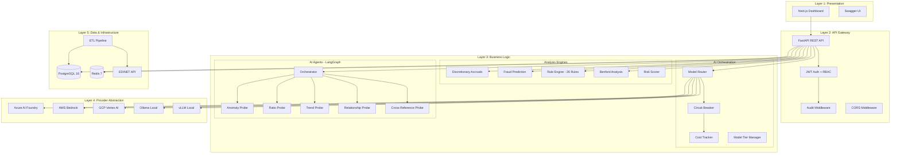
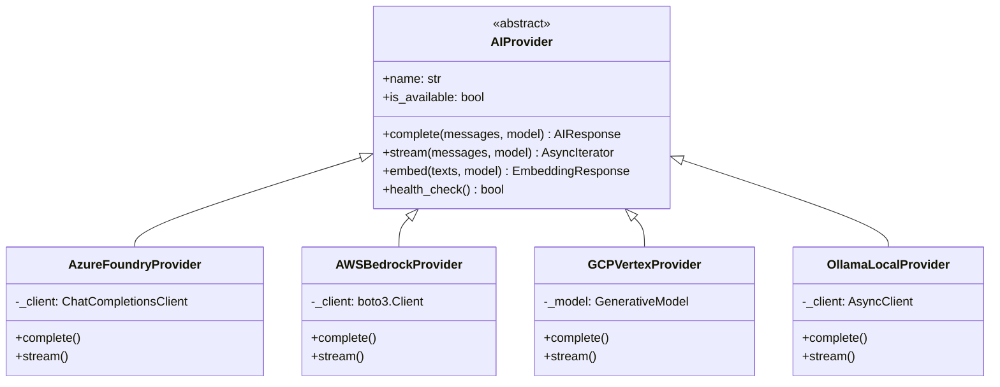
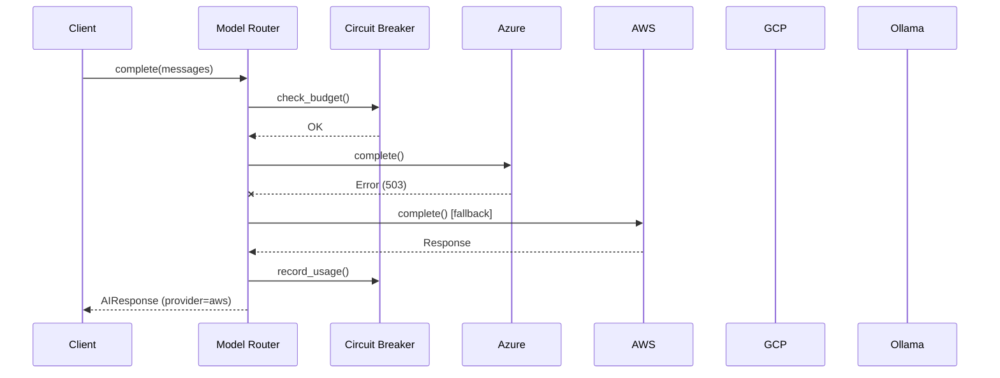
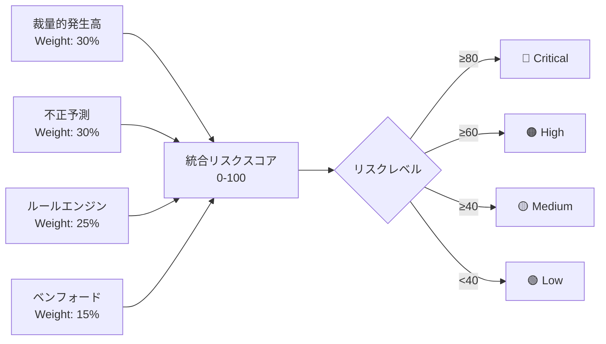
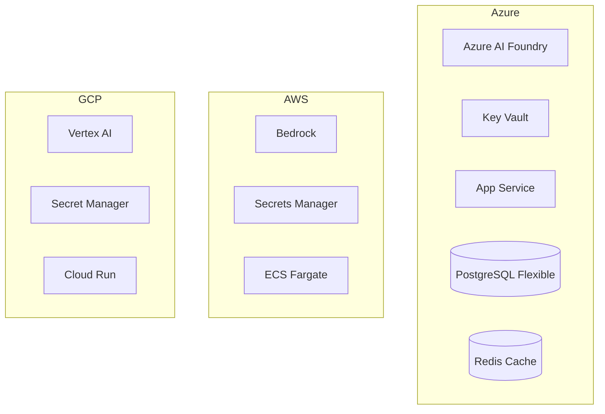

# アーキテクチャ設計書

## 1. システム概要

CS Risk Agent は、連結子会社のリスク分析を行うエンタープライズ向け マルチクラウド AI オーケストレーターである。

### 設計原則

- **Provider Pattern**: マルチクラウド AI プロバイダーを透過的に抽象化
- **Hybrid Deployment**: クラウド / ローカル LLM の構成ファイルベース切替
- **FinOps**: サーキットブレーカーによる予算管理
- **Observability**: 構造化ログ + OpenTelemetry + 監査ログ

## 2. 5層アーキテクチャ

## 3. AI Orchestration Layer

### Provider Pattern

### フォールバックチェーン

### Model Tiering

| Provider | SOTA | Cost-Effective |
|----------|------|----------------|
| Azure | GPT-4o ($2.50/1M in) | GPT-4o-mini ($0.15/1M in) |
| AWS | Claude 3.5 Sonnet ($3.00/1M in) | Claude 3 Haiku ($0.25/1M in) |
| GCP | Gemini 1.5 Pro ($1.25/1M in) | Gemini 1.5 Flash ($0.075/1M in) |
| Ollama | Llama 3.1 70B (無料) | Llama 3.1 8B (無料) |

## 4. 分析エンジン

### 統合リスクスコアリング

## 5. デプロイメントパターン

### パターン1: クラウドネイティブ (推奨)

### パターン2: ハイブリッド

- 機密データ → ローカル Ollama/vLLM
- 一般データ → クラウド AI (Azure/AWS/GCP)
- 構成: `config.yml` の `hybrid_rules` で制御

### パターン3: フルローカル

- 全処理をローカル Ollama/vLLM で実行
- インターネット接続不要
- 構成: `AI_MODE=local`

## 6. セキュリティ

- **認証**: JWT (HS256) + RBAC (5ロール)
- **シークレット**: 各クラウドの Secret Manager (Key Vault / SM / GSM)
- **通信**: TLS 1.2+ 必須
- **監査**: 全AI操作の入出力を監査ログに記録
- **データ分類**: confidential / internal / general / public
