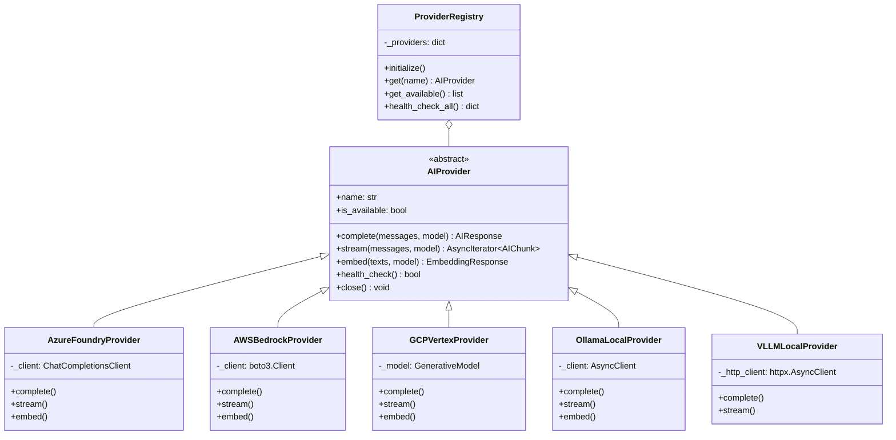

# アーキテクチャ設計書

## 1. システム概要

CS Risk Agent は、連結子会社のリスク分析を行うエンタープライズ向け マルチクラウド AI オーケストレーターである。
複数クラウドの AI サービスを統一インターフェースで抽象化し、予算管理・自動フォールバック・データ分類ベースルーティングを実現する。

### 設計原則

| 原則 | 説明 |
|------|------|
| **Provider Pattern** | マルチクラウド AI プロバイダーを透過的に抽象化。新プロバイダー追加時も既存コード変更不要 |
| **Hybrid Deployment** | クラウド / ローカル LLM の構成ファイルベース切替。機密データのオンプレ制約に対応 |
| **FinOps** | サーキットブレーカーによる月間予算管理。閾値超過時の自動遮断 |
| **Observability** | 構造化ログ (JSON) + OpenTelemetry トレース + 監査ログの三層可観測性 |
| **Defense in Depth** | JWT認証 + RBAC + データ分類 + 監査ログの多層防御 |

### 技術スタック

```
Backend:   Python 3.11 / FastAPI / SQLAlchemy 2.0 / Pydantic v2 / LangGraph
Frontend:  Next.js 15 / React 19 / shadcn/ui / Recharts / Zustand / TanStack Query v5
AI/ML:     XGBoost / scikit-learn / statsmodels / SHAP
Database:  PostgreSQL 16 (asyncpg) / Redis 7
Infra:     Terraform / Docker / GitHub Actions
```

## 2. 5層アーキテクチャ


### 各層の責務

| 層 | 責務 | 主要コンポーネント |
|----|------|-------------------|
| **L1 Presentation** | ユーザーインタラクション | Next.js ダッシュボード、Swagger UI |
| **L2 API Gateway** | 認証認可・監査・ルーティング | FastAPI + JWT + RBAC + Audit Middleware |
| **L3 Business Logic** | 分析・AI オーケストレーション | 4分析エンジン + 6AIプローブ + ルーター |
| **L4 Provider** | クラウドAI抽象化 | 5プロバイダー (Azure/AWS/GCP/Ollama/vLLM) |
| **L5 Data** | 永続化・ETL | PostgreSQL + Redis + EDINET連携 |

## 3. AI Orchestration Layer

### Provider Pattern



### フォールバックチェーン


### ルーティング決定フロー


### Model Tiering

| Provider | SOTA モデル | 入力単価 | Cost-Effective モデル | 入力単価 |
|----------|-----------|---------|---------------------|---------|
| Azure | GPT-4o | $2.50/1M tokens | GPT-4o-mini | $0.15/1M tokens |
| AWS | Claude 3.5 Sonnet | $3.00/1M tokens | Claude 3 Haiku | $0.25/1M tokens |
| GCP | Gemini 1.5 Pro | $1.25/1M tokens | Gemini 1.5 Flash | $0.075/1M tokens |
| Ollama | Llama 3.1 70B | 無料 (ローカル) | Llama 3.1 8B | 無料 (ローカル) |
| vLLM | 任意モデル | 無料 (ローカル) | - | - |

## 4. 分析エンジン

### 4.1 裁量的発生高モデル (Discretionary Accruals)

**目的**: 利益操作の可能性を検出する

- **Modified Jones Model**: 業界標準の裁量的発生高推定
- **Kothari Extension**: ROA による性能調整
- 入力: 売上高、売掛金、有形固定資産、総資産、営業CF
- 出力: DA値 (0に近いほど正常、|DA| > 0.1 で要注意)

### 4.2 不正予測モデル (Fraud Prediction)

**目的**: 財務不正の確率を推定する

| 手法 | 説明 |
|------|------|
| **Beneish M-Score** | 8変数による利益操作指標 (DSRI, GMI, AQI, SGI, DEPI, SGAI, LVGI, TATA) |
| **Altman Z-Score** | 倒産予測スコア (5変数: 流動性、累積収益性、収益性、時価、売上効率) |
| **XGBoost + Logistic Regression** | VotingClassifier アンサンブル学習 (学習データがある場合) |

- ルールベース（未学習時）とモデルベース（学習済み時）の二段構え
- リスクレベル: Critical (>80), High (>60), Medium (>40), Low (<40)

### 4.3 ルールエンジン (Rule Engine)

**目的**: 定量ルールによるリスクフラグ検出

- **26ルール**: 5カテゴリに分類

| カテゴリ | ルール例 | 重大度 |
|---------|---------|--------|
| 財務比率異常 | 売掛金増加率 > 売上増加率 x 1.5 | High |
| キャッシュフロー | 純利益 > 0 かつ 営業CF < 0 | Critical |
| 収益・費用ミスマッチ | 売上原価比率が前期比 10%+ 変動 | Medium |
| 成長異常 | 売上成長率 > 50% (急成長) | Medium |
| バランスシート | 負債比率 > 80% | High |

- **重大度ウェイト**: Critical=1.0, High=0.7, Medium=0.4, Low=0.2

### 4.4 ベンフォード分析 (Benford's Law)

**目的**: 仕訳データの不正パターン検出

- **第一桁分布検定**: カイ二乗検定 + KL ダイバージェンス
- **重複検出**: 同一金額の異常頻出を検出
- 入力: 仕訳データの金額列
- 閾値: chi-sq p値 < 0.05 でリスクフラグ

### 統合リスクスコアリング


## 5. AI Agent アーキテクチャ (LangGraph)


| プローブ | 機能 | 検出対象 |
|---------|------|---------|
| **Anomaly Probe** | 統計的異常検出 | 金額外れ値、パターン逸脱 |
| **Ratio Probe** | 財務比率分析 | 異常な比率変動、業界平均乖離 |
| **Trend Probe** | 時系列トレンド分析 | 構造変化 (σ逸脱)、トレンド反転、売上/費用乖離、成長加速度 |
| **Relationship Probe** | 関連取引分析 | 関係会社間の異常取引パターン |
| **Cross-Reference Probe** | データ照合 | 複数情報源間の不整合 |

## 6. データモデル

### ER図 (主要エンティティ)


## 7. API 設計

### エンドポイント一覧

| Method | Path | 説明 | 認証 |
|--------|------|------|------|
| GET | `/api/v1/health/` | ヘルスチェック (liveness) | 不要 |
| GET | `/api/v1/health/readiness` | レディネス (DB/Redis 接続確認) | 不要 |
| GET | `/api/v1/companies` | 企業一覧取得 | Bearer |
| POST | `/api/v1/companies` | 企業登録 | Bearer |
| POST | `/api/v1/analysis/run` | 分析実行 | Bearer |
| GET | `/api/v1/analysis/results` | 分析結果取得 | Bearer |
| GET | `/api/v1/risk-scores/summary` | リスクサマリー | Bearer |
| GET | `/api/v1/risk-scores/by-level` | レベル別リスク | Bearer |
| GET | `/api/v1/risk-scores/alerts` | アラート一覧 | Bearer |
| POST | `/api/v1/ai/insights` | AI インサイト生成 | Bearer |
| POST | `/api/v1/ai/stream` | AI ストリーミング (SSE) | Bearer |
| GET | `/api/v1/financials` | 財務データ一覧 | Bearer |
| GET | `/api/v1/financials/{id}` | 財務データ詳細 | Bearer |
| POST | `/api/v1/reports/generate-pdf` | PDF レポート生成 | Bearer |
| POST | `/api/v1/reports/generate-pptx` | PPTX レポート生成 | Bearer |
| GET | `/api/v1/admin/budget` | 予算状況確認 | Bearer (Admin) |
| POST | `/api/v1/admin/budget/reset` | 予算リセット | Bearer (Admin) |

### レスポンス例

```json
// GET /api/v1/risk-scores/summary
{
  "total_companies": 15,
  "risk_distribution": {
    "critical": 2,
    "high": 3,
    "medium": 3,
    "low": 7
  },
  "average_score": 42.5,
  "alerts_count": 8
}
```

## 8. デプロイメントパターン

### パターン1: クラウドネイティブ (推奨)


### パターン2: ハイブリッド

```yaml
# config.yml によるルーティング制御
ai:
  hybrid_rules:
    - data_classification: confidential
      provider: ollama          # 機密データ → ローカル処理
    - data_classification: internal
      provider: azure           # 社内データ → クラウド
    - data_classification: general
      provider: gcp             # 一般データ → 最安プロバイダー
```

- 機密データ → ローカル Ollama/vLLM (データ外部送出なし)
- 一般データ → クラウド AI (Azure/AWS/GCP)
- 設定: `AI_MODE=hybrid` + `config.yml`

### パターン3: フルローカル

- 全処理をローカル Ollama/vLLM で実行
- インターネット接続不要 (エアギャップ環境対応)
- 設定: `AI_MODE=local`
- 推奨ハードウェア: NVIDIA RTX 4090 以上

## 9. セキュリティ

### 認証・認可

| 要素 | 実装 |
|------|------|
| **認証方式** | JWT (HS256 / python-jose) |
| **パスワード** | bcrypt ハッシュ (passlib) |
| **トークン有効期限** | 60分 (設定変更可) |
| **RBAC** | 5ロール (Admin, Auditor, CFO, CEO, Viewer) |

### ロール別権限マトリクス

| 権限 | Admin | Auditor | CFO | CEO | Viewer |
|------|:-----:|:-------:|:---:|:---:|:------:|
| read | o | o | o | o | o |
| write | o | | | | |
| delete | o | | | | |
| analysis:run | o | o | o | | |
| reports:generate | o | o | o | o | |
| models:manage | o | | | | |
| settings:manage | o | | | | |
| admin | o | | | | |

### データ分類とルーティング

| レベル | 説明 | ルーティング先 |
|--------|------|---------------|
| `confidential` | 個人情報、機密財務データ | ローカル LLM のみ |
| `internal` | 社内限定データ | クラウドまたはローカル |
| `general` | 一般業務データ | 任意プロバイダー |
| `public` | 公開データ (有価証券報告書等) | 任意プロバイダー |

### セキュリティ対策

- **通信暗号化**: TLS 1.2+ 必須
- **シークレット管理**: 各クラウドの Secret Manager (Key Vault / SM / GSM)
- **監査ログ**: 全 AI 操作の入出力・ユーザー・IP を記録
- **CORS**: ホワイトリスト方式
- **レート制限**: 本番環境でミドルウェア有効化
- **入力バリデーション**: Pydantic v2 による全リクエスト検証

## 10. エラーハンドリング

### カスタム例外階層

```
CSRiskAgentError (基底)
├── ProviderError              # AIプロバイダーエラー
│   └── ProviderUnavailableError
├── AllProvidersFailedError    # 全プロバイダー障害
├── BudgetExceededError        # 予算超過 (サーキットブレーカー)
├── ModelNotFoundError         # モデル未定義
├── AuthenticationError        # 認証失敗
├── AuthorizationError         # 認可失敗
├── AnalysisError              # 分析エンジンエラー
├── ETLError                   # ETLパイプラインエラー
└── DataValidationError        # データ検証エラー
```

### フォールバック戦略

| エラー種別 | 対応 |
|-----------|------|
| プロバイダー一時障害 | フォールバックチェーンで次プロバイダーへ自動切替 |
| 全プロバイダー障害 | `AllProvidersFailedError` 送出、管理者通知 |
| 予算超過 | サーキットブレーカー発動、リクエスト即時遮断 |
| DB接続エラー | ヘルスチェック readiness で `degraded` 報告 |
| 認証エラー | HTTP 401 レスポンス、`WWW-Authenticate` ヘッダー付与 |

## 11. テスト戦略

| 区分 | テスト数 | カバレッジ | ツール |
|------|---------|-----------|-------|
| ユニットテスト | 750+ | 94% | pytest, pytest-asyncio |
| 統合テスト | 40+ | - | pytest, TestClient |
| E2Eテスト (Backend) | 20+ | - | pytest |
| E2Eテスト (Frontend) | 5 spec | - | Playwright |
| Lint / 型チェック | - | - | ruff, mypy |
